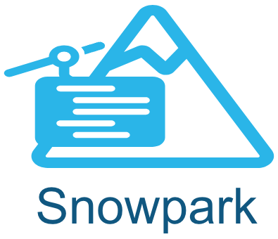

<p float="left">
  
   
</p>
  
### Status: This feature is currently in development and should __not be used with production data__.
  
# Airflow Provider for Snowpark
This guide demonstrates using Apache Airflow to orchestrate a machine learning pipeline leveraging Airflow Operators and Decorators for Snowpark Python as well as a new customer XCOM backend using Snowflake tables and stages.  While this demo shows both the operators and the xcom backend either can be used without the other.

At a high level [Astronomer's Snowflake Provider](https://github.com/astronomer/astro-provider-snowflake) provides the following:

- Snowpark operators and decorators: [Snowpark Python](https://docs.snowflake.com/en/developer-guide/snowpark/python/index) provides an intuitive Dataframe API as well as the ability to run python-based User-Defined Functions and Stored Procedures for processing data in Snowflake. The provider includes operators and decorators to simplify data passing, remove boiler-plate setup and teardown operations, and generally simplify running Snowpark python tasks. 

Example:
```python
@snowpark_python_task(task_id='feature_engineering', temp_data_output='stage', temp_data_stage='MY_STAGE')
def feature_engineering(taxidf:SnowparkTable) -> SnowparkTable:

		taxidf = taxidf.with_column('HOUR_OF_DAY', F.col('HOUR').cast(T.StringType()))

        new_df = snowpark_session.create_dataframe(pd.DataFrame(['x','y'], columns=['name']))

    return taxidf, newdf
```
  
All operators include the following functionality:  
-  __Snowpark Session__: A session instance called `snowpark_session` is automatically created (using Airflow Snowflake connection parameters) and can be referenced by user python code.
-  __SnowparkTable Object__: A new datatype was created that represents a SnowparkTable. This is serializable and can be passed between tasks. Any arguments of the python function which are annotated as `SnowparkTable` will be automatically instantiated as Snowpark Dataframes in the users code. Additionally the SnowparkTable is interchangeable with [Astro SDK Table and TempTable](https://github.com/astronomer/astro-sdk/tree/main) objects.
-  __Snowpark Dataframe serialization and deserialization__: Snowpark Dataframes returned from python functions can be serialized to a Snowflake table or stage as set in `temp_data_output = 'stage'|'table'|None`. The database and stage used for serialization can optionally be set in `temp_data_database` and `temp_data_schema`.  If these are not set the provider will use the database/schema as set in Operator/Decorator parameters, the Airlfow Snowflake connection and lastly the default database/schema in Snowflake user settings.  Snowpark Dataframes serialized to stage will be saved as Parquet files.  Table/Stage data will be deserialized automatically as Snowpark Dataframes in the receiving task.

See [below](#available-snowpark-operators-and-decorators) for a list of all Operators and Decorators.
  
-  __The custom XCOM backend__: To provide additional security and data governance the Snowflake XCOM backend allows storing task input and output in Snowflake. Rather than storing potentially-sensitive data in the Airflow XCom tables Snowflake users can now ensure that all their data stays in Snowflake.  This also allows passing large data and/or non-serializable data (ie. Pandas dataframes) between tasks. JSON-serializable data is stored in an XCom table and large or non-serializable data is stored as objects in a Snowflake stage.

-  __Docker Buildkit__: Due to Snowpark python version dependencies it may be necessary to create a python virtual environment for the Snowpark client.  Astronomer has created a [Docker buildkit](https://github.com/astronomer/astro-provider-venv) to drastically simplify building this environment with a new `PYENV` function.  The PYENV creation is also cached in Docker layers which reduces time in building images.
Example: 
```Dockerfile
# syntax=quay.io/astronomer/airflow-extensions:latest

FROM quay.io/astronomer/astro-runtime:8.5.0-base

PYENV 3.8 snowpark requirements-snowpark.txt
```

## Package
# TODO
The provider package is available at https://github.com/mpgreg/airflow-snowpark-demo/blob/main/include/astro_provider_snowflake-0.0.1.dev-py3-none-any.whl
  
# Demonstration
The following demo has been created to show the use of this provider and leverages the Astro CLI to create a local dev instance of Airflow.

## Prerequisites  
  
- Astro [CLI](https://docs.astronomer.io/astro/cli/get-started)
- Docker Desktop
- Git
- Snowflake account: For this demo a free tier [trial account](https://signup.snowflake.com/) will suffice.

## Setup  
  
1. Install Astronomer's [Astro CLI](https://github.com/astronomer/astro-cli).  The Astro CLI is an Apache 2.0 licensed, open-source tool for building Airflow instances and is the fastest and easiest way to be up and running with Airflow in minutes. Open a terminal window and run:

For MacOS  
```bash
brew install astro
```
  
For Linux
```bash
curl -sSL install.astronomer.io | sudo bash -s
```

2. Clone this repository:
```bash
git clone https://github.com/mpgreg/airflow-snowpark-demo
cd airflow-snowpark-demo
```
  
3. Setup Snowflake account credentials as environment variables.  Edit the `.env` file and update `AIRFLOW_CONN_SNOWFLAKE_DEFAULT` with your credentials.  This demo will use a database named `demo` which will be setup below.

4.  Start Apache Airflow:
```sh
astro dev start
```  

5. Connect to the Airflow Scheduler container.
```bash
astro dev bash -s
```
Setup the Snowflake database, schema, tables, etc for this demo.  This must be run as a user with admin priveleges.  Alternatively look at the setup scripts and have a Snowflake administrator create these objects and grant permissions.
```bash
python include/utils/setup_snowflake.py \
  --conn_id 'snowflake_default' \
  --admin_role 'sysadmin' \
  --database 'demo' \
  --schema 'demo'
exit
```  
  
6. Connect to the Local [Airflow UI](http://localhost:8080) at (http://localhost:8080) and login with **Admin/Admin**  
    If you did not add the Snowflake connection to the .env file add it now in the Admin -> Connections menu.  

7. Run the [snowpark_demo DAG](http://localhost:8080/dags/snowpark_demo/grid).   This demo will create tables in the database and schema as specified in the `snowflake_default` connection parameters or as specified in the users's defaults in Snowflake.  Update the `_SNOWFLAKE_CONN_ID` variable in the DAG file or change the connection parameters to use the database and schema of choice.

8. Optionally run a more advanced DAG. 
- Build the Streamlit applicaiton image:
```bash
docker build -t sissyg-streamlit:latest include/streamlit
```
- Uncomment the weaviate, ner-transformers and streamlit container sections in the `docker-compose.override.yml`  
- Restart the services. 
```bash
astro dev restart
```  
- Run the [customer_analytics DAG](http://localhost:8080/dags/customer_analytics/grid). 
- After the DAG completes connect to the Streamlit [Customer Analytics Dashboard](http://localhost:8501).
- Open the streamlit application [http://localhost:8501](http://localhost:8501)

## Available Snowpark Operators and Decorators:

- `SnowparkPythonOperator`: This is the simplest operator which runs as a PythonOperator in the Airflow instance.  This requires that the Airflow instance is running a version of python supported by Snowpark and has Snowpark Python package installed. NOTE: Currently Snowpark only supports python 3.8 so this operator has limited functionality.  Snowpark python for 3.9 and 3.10 is expected soon.
- `SnowparkVirtualenvOperator`: This operator creates a python virtualenv to run the python callable in a subprocess.  Users can specify python package requirements (ie. snowflake-snowpark-python).  It is assumed that the python version specified is installed.  The [Astronomer buildkit](https://github.com/astronomer/astro-provider-venv) can be used to add this to a Docker container.
- `SnowparkExternalPythonOperator`: This operator runs the Snowpark python callable in a pre-existing virtualenv. It is assumed that Snowpark is already installed in that environment. Using the [Astronomer buildkit](https://github.com/astronomer/astro-provider-venv) will simplify building this environment.
- `SnowparkPythonUDFOperator`: Work in progress
- `SnowparkPythonSPROCOperator`: Work in progress
- `snowpark_python_task`: Decorator for SnowparkPythonOperator
- `snowpark_virtualenv_task`: Decorator for SnowparkVirtualenvOperator
- `snowpark_ext_python_task`: Decorator for SnowparkExternalPythonOperator

The `astro-provider-snowflake` package must also be installed for the SnowparkVirtualenvOperator or SnowparkExternalPythonOperator in order to use SnowparkTable objects. 


  
### Open a Terminal window for the following steps.
  
1. Install Astronomer's [Astro CLI](https://github.com/astronomer/astro-cli).  The Astro CLI is an Apache 2.0 licensed, open-source tool for building Airflow instances and is the fastest and easiest way to be up and running with Airflow in minutes. Open a terminal window and run:

For MacOS  
```bash
brew install astro
```
  
For Linux
```bash
curl -sSL install.astronomer.io | sudo bash -s
```

2. Clone this repository.  
```bash
git clone https://github.com/mpgreg/airflow-snowpark-containers-demo
cd airflow-snowpark-containers-demo
```
  
3. Save your Snowflake and OpenAI account credentials as environment variables.  Edit the following strings with your account information and run the export command in the terminal window where you will run the remaining commands.
```bash
export AIRFLOW_CONN_SNOWFLAKE_DEFAULT='{"conn_type": "snowflake", "login": "USER_NAME", "password": "PASSWORD", "schema": "demo", "extra": {"account": "ORG_NAME-ACCOUNT_NAME", "warehouse": "WAREHOUSE_NAME", "database": "sissyg", "region": "REGION_NAME", "role": "USER_ROLE", "authenticator": "snowflake", "session_parameters": null, "application": "AIRFLOW"}}'
```
```bash
export OPENAI_APIKEY='sk-xxxxxxxxxxxxxxxxxxxxxxxx'
```
__NOTE__: The ACCOUNT field of the connection string should use the new <ORG_NAME>-<ACCOUNT_NAME> format as per [Snowflake Account Identifier policies.](https://docs.snowflake.com/en/user-guide/admin-account-identifier)  Snowpark Containers are not supported with the legacy account identifiers (ie. xxx111111.prod1.us-west-2.aws )

The demo setup (below) creates databases and schemas for access by the __DEMO__ role.
            
4.  Start a local Apache Airflow instance.  The astro CLI will build docker containers with python requirements and start local docker containers.
```bash
astro dev start
```
  
5. For private preview it is necessary to enable OAUTH services for the Snowflake account.  Run the following with `ACCOUNTADMIN` privileges:
```sql
CREATE SECURITY INTEGRATION snowservices_ingress_oauth
TYPE=oauth
OAUTH_CLIENT=snowservices_ingress
ENABLED=true;
```
  
6. Setup Snowflake databases and schemas.  These steps can be automated with the `setup_snowflake.py` script.  To simplify dependency management this script can be run from within the Airflow Scheduler container.  First connect to the Scheduler container:
```bash
astro dev bash -s
```
Run the setup script:
```bash
python include/utils/setup_snowflake.py \
  --conn_id 'snowflake_default' \
  --admin_role 'sysadmin' \
  --demo_role 'demo' \
  --database 'sissyg' \
  --schema 'demo'
exit
```
__NOTE__: The `setup_snowflake.py` script uses the account credentials you exported in your terminal environment variable and assumes the role of SYSADMIN to create databases and grant privileges to the user and role running the demo.  This assumes that the user has access to sysadmin or another role with grant privileges.  If running the script skip ahead to step 8.

See the [Snowflake Setup Steps](include/utils/snowflake_setup.md) to run the setup steps manually instead of using the script.

If changing the database or schema for you will need to update the environment variables for AIRFLOW_CONN_SNOWFLAKE_DEFAULT and the XCOM backend in the Airflow Scheduler and Airflow Runner.  

Example:
```yaml
environment:
  AIRFLOW__CORE__XCOM_SNOWFLAKE_TABLE: '<NEW DATABASE and/or SCHEMA>'
  AIRFLOW__CORE__XCOM_SNOWFLAKE_STAGE: '<NEW DATABASE and/or SCHEMA>'
```
In the following docker-compose-override.yml file.  

Don't forget to `astro dev restart` if you changed the environment variables
  
7. Run the Airflow Customer Analytics DAG in the Airflow UI 
```bash
astro dev run dags unpause customer_analytics
astro dev run dags trigger customer_analytics
```
Follow the status of the DAG run in the [Airflow UI](http://localhost:8080/dags/customer_analytics/grid) (username: `admin`, password: `admin`)
        
8. After the DAG completes open the [streamlit application](http://localhost:8501)

Other service UIs are available at the the following:
- Airflow: [http://localhost:8080](http://localhost:8080) Username:Password is admin:admin
- Grafana: [http://localhost:3000](http://localhost:3000)  Username:Password is admin:admin
- Minio: [http://localhost:9000](http://localhost:9000) Username:Password is minioadmin:minioadmin
- Weaviate: [https://console.weaviate.io/](https://link.weaviate.io/3UD9H8z) Enter localhost:8081 in the "Self-hosted Weaviate" field.

9. If you are running on a non-x86 system (ie. Mac M1/M2) the containers built (in the background) by Astro CLI will need to be rebuilt for x86 architecture in order to run in Snowpark Containers.
```bash
docker buildx build --load --platform linux/amd64 -t airflow-runner:amd64 include/airflow_task_runner
docker buildx build --load --platform linux/amd64 -t sissyg-streamlit:amd64 include/streamlit
docker buildx build --load --platform linux/amd64 -t prometheus:amd64 include/prometheus
docker buildx build --load --platform linux/amd64 -t grafana:amd64 include/grafana
```
Alternatively, if the containers were built on an x86 system they only need to be retagged.
```bash
docker tag airflow-runner:local airflow-runner:amd64
docker tag sissyg-streamlit:local sissyg-streamlit:amd64
docker tag prometheus:local prometheus:amd64
docker tag grafana:local grafana:amd64
```
  
10. Create a Python virtual environment to setup Snowpark Containers Services.
```bash
pip install virtualenv
python -m virtualenv snowpark_containers_venv
source snowpark_containers_venv/bin/activate 
pip install pandas docker 'apache-airflow-providers-snowflake==4.1.0'
python
```
  
11. Use the SnowparkContainersHook to setup the Snowpark Containers compute pool and image reposity, and push the container images to the repository.

Each Snowpark Container is instantiated from a spec file.  For this demo the spec files are in `include/<service_name>` directories. These will be used by the hook to push images as well as CRUD operations on the services.

- Add the OpenAI api key for the streamlit service container.  Edit the file `include/streamlit/snowpark_container_spec.yml` and update the `OPENAI_APIKEY` environment variable with your key (from step 3).

The `push_images` command requires docker which cannot be run from inside a docker container (as the Airflow Scheduler).  Therefore these commands must be run from local python instances.

In the python shell from the previous step run the following: 

```python
from include.astronomer.providers.snowflake.hooks.snowpark_containers import SnowparkContainersHook

snowpark_container_services = ['minio', 'weaviate', 'airflow_task_runner', 'streamlit']

hook = SnowparkContainersHook()

repository_name = hook.create_repository(repository_name='sissyg')

pool_name = hook.create_pool(pool_name='sissyg', min_nodes=1, max_nodes=1, replace_existing=False)

for service_name in snowpark_container_services:
  hook.push_images(
    service_name=service_name,
    database='sissyg',
    schema='demo',
    repository_name=repository_name,
    spec_file_name=f'include/{service_name}/snowpark_container_spec.yml'
  )
  
  hook.create_service(repository_name=repository_name, 
            pool_name=pool_name, 
            spec_file_name=f'include/{service_name}/snowpark_container_spec.yml', 
            min_inst=1,
            max_inst=1,
            replace_existing=True)
  

```

The Astro Airflow instance running in dev mode will be able to run tasks in Snowpark Containers Airflow Task Runner.  

12. Open the `dags/customer_analytics.py` file and change the line `_LOCAL_MODE = True` to `_LOCAL_MODE = False`

13. In the [Airflow Web UI](http://localhost:8080) trigger the customer_analytics DAG via the 'play' button in the top right corner.  This time when the DAG runs it will push down not only all of the SQL commands to run in Snowflake but also all of the SnowparkContainers python tasks will run in the Airflow runner.

